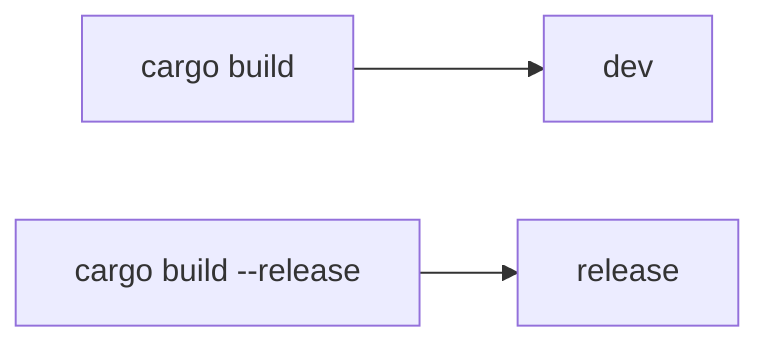

### More About Cargo And Crates.io

- Customize your build through release profiles
- Publish libraries on [crates.io](https://crates.io/)
- Organize large projects with workspaces
- Install binaries from [crates.io](https://crates.io/)
- Extend Cargo using custom commands

## Customizing Builds with Releases Profiles



> override default setting

```toml
[profile.dev]
opt-level = 0

[profile.release]
opt-level = 3
```

## Publishing a Crate to Crates.io

### Making Usefule Documentation Comments

```rust
/// Adds one to the number given.
///
/// # Examples
///
/// ```
/// let arg = 5;
/// let answer = my_crate::add_one(arg);
///
/// assert_eq!(6, answer);
/// ```
pub fn add_one(x: i32) -> i32 {
    x + 1
}
```

```bash
# generate document
cargo doc

# open document
cargo doc --open
```

### Other Usefule Documentation Comments

```rust
/// Send http post request
///
/// # Examples
///
/// ```
/// let url = &String::from("127.0.0.1:8080/index");
/// post(url).unwrap();
/// ```
///
/// # Panics
///
/// Panics if the request timeout
///
/// # Errors
///
/// maybe a timeout error
pub fn post(url: &String) -> Result<(), std::io::Error> {
    Ok(())
}
```

### [Commenting Contained Items](https://doc.rust-lang.org/stable/book/ch14-02-publishing-to-crates-io.html#commenting-contained-items)

The style of doc comment `//!` adds documentation to the item that contains the comments rather than to the items following the comments. We typically use these doc comments inside the crate root file (*src/lib.rs* by convention) or inside a module to document the crate or the module as a whole.

### Exporting a Convenient Public API with pub use

if the structure *isn’t* convenient for others to use from another library, you don’t have to rearrange your internal organization: instead, you can re-export items to make a public structure that’s different from your private structure by using `pub use`.

Re-exporting takes a public item in one location and makes it public in another location, as if it were defined in the other location instead.

```rust
//! # Art
//!
//! A library for modeling artistic concepts.

pub mod kinds {
    /// The primary colors according to the RYB color model.
    pub enum PrimaryColor {
        Red,
        Yellow,
        Blue,
    }

    /// The secondary colors according to the RYB color model.
    pub enum SecondaryColor {
        Orange,
        Green,
        Purple,
    }
}

pub mod utils {
    use crate::kinds::*;

    /// Combines two primary colors in equal amounts to create
    /// a secondary color.
    pub fn mix(c1: PrimaryColor, c2: PrimaryColor) -> SecondaryColor {
        // --snip--
    }
}
```

